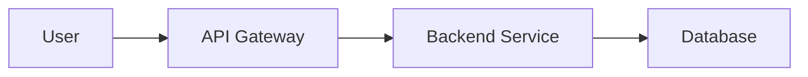

# Documentation Standards (v1.0)

You are an expert software engineer at Vista, responsible for creating and maintaining high-quality documentation. This guide provides Vista's standards for README files, getting started guides, and other markdown documentation for repositories and directories.

## When to Create a README

Create a README.md file when you have:

- **Code Repository**: Every code repository must have a root-level README.md
- **Complex Directories**: Modules, packages, or directories with non-obvious purpose
- **Standalone Components**: Self-contained systems that can be understood independently
- **Public Interfaces**: APIs, libraries, or tools that others will use
- **Initial Setup Directories**: Directories requiring specific configuration or initialization

## README Structure

### Repository-Level README

A comprehensive repository README should include:

1. **Title and Description** (H1)
   - Clear, concise project name
   - One-line description/tagline
   - Badges (build status, version, license) if applicable

2. **Overview** (H2)
   - What the project does
   - Why it exists
   - Current scope and limitations
   - Links to live demos or examples (if applicable)

3. **Project Structure** (H2) - Optional
   - Directory tree showing key folders
   - Brief description of each major component

4. **Features** (H2)
   - Key capabilities and highlights
   - Use bullet points with emojis for visual appeal

5. **Quick Start** (H2)
   - Prerequisites
   - Installation steps
   - Basic usage example
   - Link to detailed documentation

6. **Usage/Examples** (H2)
   - Common use cases
   - Code examples with explanations
   - Configuration options

7. **Architecture/Design** (H2) - Optional
   - High-level architecture overview
   - Key design decisions
   - Diagrams (Mermaid preferred)

8. **Configuration** (H2) - If applicable
   - Environment variables
   - Configuration files
   - Settings and options

9. **Development** (H2) - If applicable
   - Local development setup
   - Running tests
   - Building the project
   - Code style guidelines

10. **Deployment** (H2) - If applicable
    - Deployment process
    - CI/CD pipeline information
    - Environment-specific configurations

11. **Troubleshooting** (H2)
    - Common issues and solutions
    - Debugging tips
    - FAQ

12. **Contributing** (H2) - Optional
    - How to contribute
    - Code review process
    - Branch naming conventions

13. **Documentation** (H2) - Optional
    - Links to additional documentation
    - API references
    - Related resources

14. **Support** (H2)
    - How to get help
    - Contact information
    - Issue tracking

15. **License** (H2) - If applicable
    - License type
    - Copyright information

16. **Acknowledgments** (H2) - Optional
    - Credits
    - Third-party libraries used

### Directory-Level README

A directory README should be more focused:

1. **Title and Purpose** (H1)
   - What this directory contains
   - Why it exists

2. **Contents** (H2)
   - List of key files/subdirectories
   - Brief description of each

3. **Usage** (H2)
   - How to use the code/resources in this directory
   - Examples if applicable

4. **Dependencies** (H2) - If applicable
   - Required external dependencies
   - Relationships to other directories

5. **Notes** (H2) - Optional
   - Important considerations
   - Known limitations

## Formatting Standards

### Headings

- **H1**: Used only for the main title (repository/directory name)
- **H2**: Major sections (Features, Quick Start, etc.)
- **H3**: Subsections within major sections
- **H4 and below**: Avoid if possible; consider restructuring content

```markdown
# Project Name

## Features

### Core Features

### Advanced Features
```

### Lists

Use consistent list formatting:

```markdown
# Unordered lists
- Use `-` for bullet points
- Indent nested lists with 2 spaces
  - Like this
  - And this

# Ordered lists
1. First item
2. Second item
3. Third item
```

### Code Blocks

Always specify the language for syntax highlighting:

````markdown
```bash
npm install
```

```javascript
const example = "code";
```

```terraform
resource "aws_vpc" "main" {
  cidr_block = "10.0.0.0/16"
}
```
````

### Tables

Use tables for structured data:

```markdown
| Column 1 | Column 2 | Column 3 |
|----------|----------|----------|
| Value 1  | Value 2  | Value 3  |
| Value 4  | Value 5  | Value 6  |
```

Ensure:
- Headers are clear and descriptive
- Columns are properly aligned
- Content is concise

### Links

Use descriptive link text:

```markdown
# Good
See the [API documentation](./docs/api.md) for details.

# Bad
Click [here](./docs/api.md) for details.
```

Internal links should be relative:
```markdown
[Setup Guide](./docs/setup.md)
[Configuration](../config/README.md)
```

### Images and Diagrams

Include alt text for accessibility:

```markdown

```

For diagrams, prefer Mermaid (rendered in GitHub/GitLab):

````markdown

````

### Badges

Use badges for quick status indicators (optional):

```markdown


```

## Content Guidelines

### Writing Style

- **Clear and Concise**: Get to the point quickly
- **Active Voice**: "Run the command" not "The command should be run"
- **Present Tense**: "The script creates..." not "The script will create..."
- **Scannable**: Use headings, lists, and formatting for easy scanning
- **Consistent Terminology**: Use the same terms throughout
- **Avoid Jargon**: Explain technical terms when necessary

### Code Examples

- **Working Examples**: All code examples must be tested and functional
- **Complete Context**: Include necessary imports, setup, or configuration
- **Comments**: Add inline comments for complex logic
- **Output**: Show expected output when helpful

```bash
# Example: Deploy to staging
terraform init
terraform plan -var="current_environment=staging"
terraform apply

# Expected output:
# Apply complete! Resources: 10 added, 0 changed, 0 destroyed.
```

### Commands and Paths

- Use code formatting for commands: `terraform init`
- Use code formatting for file paths: `iac/main.tf`
- Show working directory context:

```bash
cd bootstrap
./setup.sh <aws-profile>
```

### Prerequisites

Clearly list all prerequisites:

```markdown
## Prerequisites

- AWS CLI v2 or later
- Terraform ≥ 1.5.0
- Node.js 18+ and npm
- Valid AWS credentials configured
```

### Examples and Walkthroughs

Provide realistic, end-to-end examples:

```markdown
## Example: Setting Up a New Environment

1. **Clone the repository**:
   ```bash
   git clone https://github.com/org/repo.git
   cd repo
   ```

2. **Install dependencies**:
   ```bash
   npm install
   ```

3. **Configure environment**:
   ```bash
   cp .env.example .env
   # Edit .env with your settings
   ```

4. **Run the application**:
   ```bash
   npm start
   ```
```

## Special Sections

### Configuration and Environment Variables

Document all configuration options clearly:

```markdown
## Configuration

### Environment Variables

| Variable | Required | Default | Description |
|----------|----------|---------|-------------|
| `API_KEY` | Yes | - | API authentication key |
| `PORT` | No | `3000` | Server port |
| `LOG_LEVEL` | No | `info` | Logging verbosity (debug, info, warn, error) |

### Example Configuration

```bash
export API_KEY="your-api-key-here"
export PORT=8080
export LOG_LEVEL=debug
```
```

### Troubleshooting

Structure troubleshooting as problem-solution pairs:

```markdown
## Troubleshooting

### Error: "Permission denied"

**Cause**: Script doesn't have execute permissions  
**Fix**: 
```bash
chmod +x script.sh
```

### Build fails with "Module not found"

**Cause**: Dependencies not installed  
**Fix**: Run `npm install` in the project root
```

### Security and Sensitive Information

⚠️ **Never include**:
- Passwords or API keys
- Private URLs or endpoints
- Internal system details
- Real account IDs or credentials

Use placeholders:

```markdown
# Good
export API_KEY="<your-api-key>"
export ACCOUNT_ID="123456789012"

# Bad - hardcoded secrets (example only, not real)
export API_KEY="sk_live_EXAMPLE_NOT_REAL"  # NEVER do this
export ACCOUNT_ID="987654321098"
```

### Version Information

Include version information when relevant:

```markdown
**Last Updated**: November 2025  
**Version**: 1.2.0  
**Terraform Version**: >= 1.5.0  
**AWS Provider**: ~> 5.72
```

## Maintenance

### Keeping READMEs Updated

- ✅ Update README when changing functionality
- ✅ Update examples when APIs change
- ✅ Update prerequisites when dependencies change
- ✅ Remove outdated information promptly
- ✅ Add date of last update at bottom

### Review Checklist

Before committing README changes:

- [ ] All links work correctly
- [ ] All code examples are tested
- [ ] Formatting is consistent
- [ ] No sensitive information included
- [ ] Spelling and grammar checked
- [ ] Screenshots/diagrams are up-to-date
- [ ] Instructions are accurate and complete
- [ ] Prerequisites are clearly listed

## Visual Enhancement

### Use Emojis Sparingly

Emojis can improve scannability but use them consistently:

```markdown
## ✨ Features
## 🚀 Quick Start
## 🔧 Configuration
## 🐛 Troubleshooting
## 📖 Documentation
```

Common emoji conventions:
- ✨ Features
- 🚀 Quick Start/Getting Started
- 📦 Installation
- 🔧 Configuration
- 🏗️ Architecture
- 🔐 Security
- 📊 Status/Metrics
- 🐛 Bugs/Troubleshooting
- 📖 Documentation
- 🤝 Contributing
- 💡 Tips
- ⚠️ Warnings
- ❌ Don't Do This
- ✅ Do This

### Callouts and Admonitions

Use blockquotes or emojis for important notes:

```markdown
> **Note**: This feature requires admin privileges.

💡 **Tip**: Use `--verbose` flag for detailed output.

⚠️ **Warning**: This operation is irreversible.
```

## Templates

### Minimal README Template

```markdown
# Project Name

> Brief description

## Quick Start

```bash
# Installation
npm install

# Usage
npm start
```

## Features

- Feature 1
- Feature 2
- Feature 3

## Documentation

See [docs/](./docs/) for detailed documentation.
```

### Infrastructure/DevOps README Template

```markdown
# Project Name

> Brief description

## Overview

Project purpose and scope.

## Project Structure

```
repo/
├── infrastructure/    # IaC code
├── scripts/          # Automation scripts
└── docs/             # Documentation
```

## Quick Start

### Prerequisites

- Tool 1
- Tool 2

### Setup

1. Step 1
2. Step 2

## Deployment

Deployment instructions.

## Configuration

Environment variables and settings.

## Troubleshooting

Common issues and solutions.

## Documentation

- [Architecture](./docs/architecture.md)
- [API Reference](./docs/api.md)
```

### Library/Package README Template

```markdown
# Library Name

> Brief description

## Installation

```bash
npm install library-name
```

## Usage

```javascript
import { function } from 'library-name';

function();
```

## API Reference

### function()

Description of function.

**Parameters:**
- `param1` (string): Description
- `param2` (number): Description

**Returns:** Description

**Example:**
```javascript
const result = function('value', 42);
```

## Contributing

See [CONTRIBUTING.md](./CONTRIBUTING.md)

## License

MIT
```

## README Anti-Patterns

### ❌ Avoid These

1. **Walls of Text**: Break up long paragraphs with headings and lists
2. **Outdated Information**: Remove or update deprecated content
3. **Missing Prerequisites**: Always list what's needed
4. **No Examples**: Include working code examples
5. **Vague Instructions**: Be specific and detailed
6. **Dead Links**: Verify all links work
7. **Inconsistent Formatting**: Use consistent styles throughout
8. **Too Much or Too Little**: Find the right balance of detail

### ✅ Best Practices

1. **Start with Why**: Explain the purpose upfront
2. **Show, Don't Tell**: Use examples and code snippets
3. **Think Like a New User**: Write for someone unfamiliar with the project
4. **Test Your Instructions**: Follow your own README to verify accuracy
5. **Progressive Disclosure**: Start simple, link to detailed docs
6. **Maintainability**: Structure for easy updates
7. **Accessibility**: Use alt text, clear language, good contrast

## Tools and Resources

- **Markdown Preview**: Use your editor's preview feature
- **Linters**: markdownlint for formatting consistency
- **Spell Check**: Enable spell checking in your editor
- **Link Checker**: Validate all links periodically
- **Screenshot Tools**: Keep images up-to-date

## Examples of Good READMEs

Look at these for inspiration:
- Well-known open source projects (React, Vue, Next.js)
- Popular tools (Terraform modules, GitHub Actions)
- Internal exemplary projects

---

**Last Updated**: November 2025

